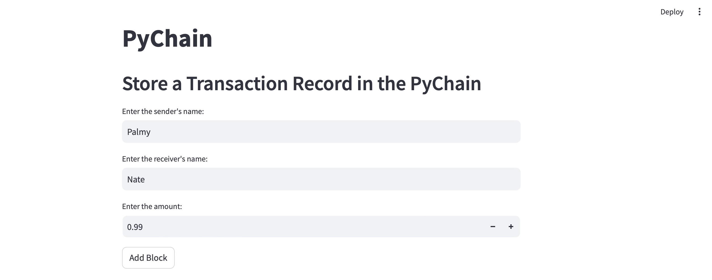
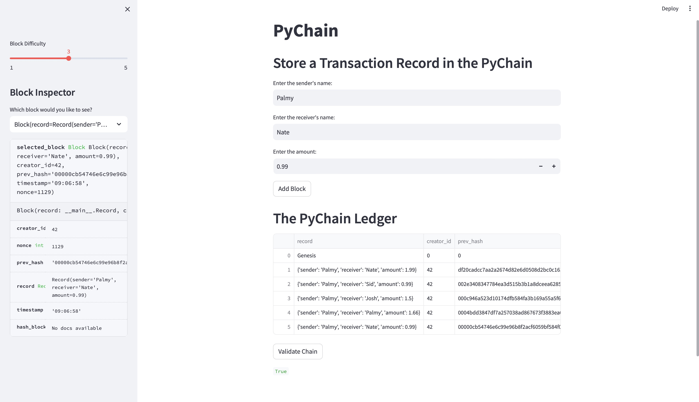

# PyChain Ledger

You’re a fintech engineer who’s working at one of the five largest banks in the world. You were recently promoted to act as the lead developer on their decentralized finance team. Your task is to build a blockchain-based ledger system, complete with a user-friendly web interface. This ledger should allow partner banks to conduct financial transactions (that is, to transfer money between senders and receivers) and to verify the integrity of the data in the ledger.

You’ll make the following updates to the provided Python file for this assignment, which already contains the basic `PyChain` ledger structure that you created throughout the module:

### Step 1: Create a Record Data Class

Define a new Python data class named `Record`. Give this new class a formalized data structure that consists of the `sender`, `receiver`, and `amount` attributes. To do so, complete the following steps:

1. Define a new class named `Record`.

2. Add the `@dataclass` decorator immediately before the `Record` class definition.

#### @dataclass
#### class Record:
####     sender: str
####     receiver: str
####     amount: float

### Step 2: Modify the Existing Block Data Class to Store Record Data

### @dataclass
### class Block:

###     # @TODO
###     # Rename the `data` attribute to `record`, and set the data type to `Record`
###     record: Record

### Step 3: Add Relevant User Inputs to the Streamlit Interface

Code additional input areas for the user interface of your Streamlit application. Create these input areas to capture the sender, receiver, and amount for each transaction that you’ll store in the `Block` record. To do so, complete the following steps:

1. Delete the `input_data` variable from the Streamlit interface.

2. Add an input area where you can get a value for `sender` from the user.

### sender = st.text_input("Enter the sender's name:")

3. Add an input area where you can get a value for `receiver` from the user.
   
### receiver = st.text_input("Enter the receiver's name:")

4. Add an input area where you can get a value for `amount` from the user.
   
### amount = st.number_input("Enter the amount:", min_value=0.0)

5. As part of the “Add Block” button functionality, update `new_block` so that `Block` consists of an attribute named `record`, which is set equal to a `Record` that contains the `sender`, `receiver`, and `amount` values. The updated `Block` should also include the attributes for `creator_id` and `prev_hash`.
### if st.button("Add Block"):
###     prev_block = pychain.chain[-1]
###     prev_block_hash = prev_block.hash_block()

###     # Update `new_block` so that `Block` consists of an attribute named `record`
###     # which is set equal to a `Record` that contains the `sender`, `receiver`,
###     # and `amount` values
###     new_block = Block(
###         record=Record(sender=sender, receiver=receiver, amount=amount),
###         creator_id=42,
###         prev_hash=prev_block_hash
###     )

###     pychain.add_block(new_block)
###     st.balloons()

### Step 4: Test the PyChain Ledger by Storing Records

Test your complete `PyChain` ledger and user interface by running your Streamlit application and storing some mined blocks in your `PyChain` ledger. Then test the blockchain validation process by using your `PyChain` ledger. To do so, complete the following steps:

1. In the terminal, navigate to the project folder where you've coded this assignment.

### (dev)18.Blockchain_hw % conda activate dev
### (dev)18.Blockchain_hw % python pychain.py

2. In the terminal, run the Streamlit application by using `streamlit run pychain.py`.

### (dev)18.Blockchain_hw % streamlit run pychain.py 

3. Enter values for the sender, receiver, and amount, and then click the Add Block button. Do this several times to store several blocks in the ledger.

4. Verify the block contents and hashes in the Streamlit dropdown menu. Take a screenshot of the Streamlit application page, which should detail a blockchain that consists of multiple blocks. 

5. Test the blockchain validation process by using the web interface. Take a screenshot of the Streamlit application page, which should indicate the validity of the blockchain. 

---

© 2022 edX Boot Camps LLC. Confidential and Proprietary. All Rights Reserved.
